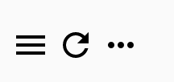
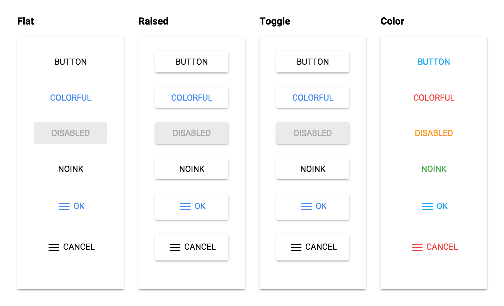
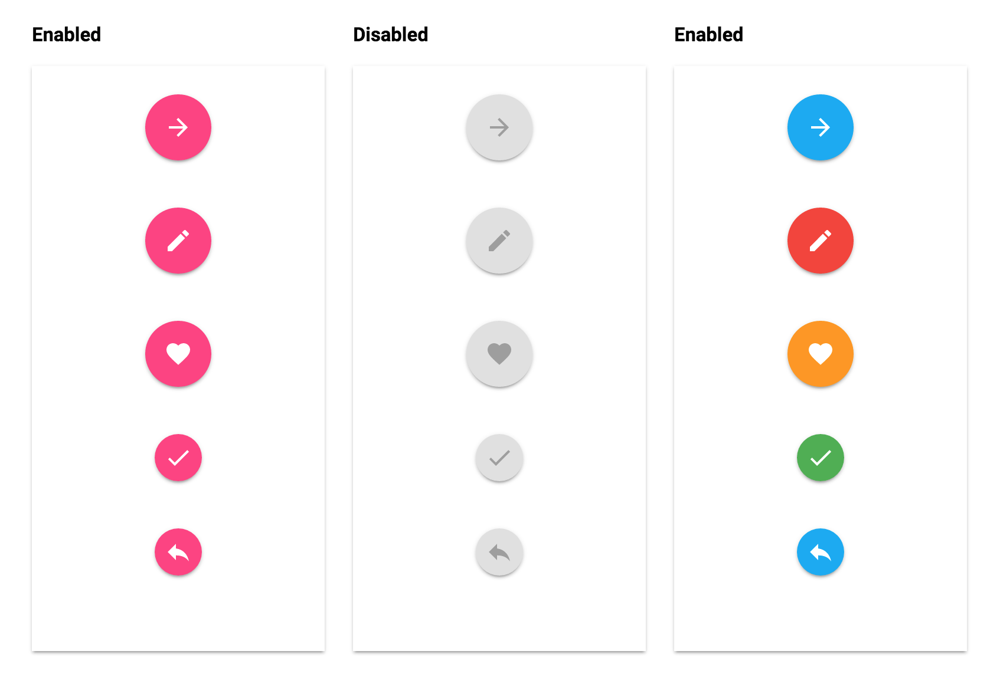
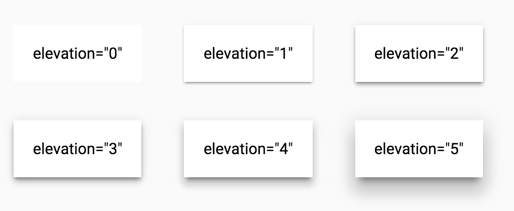

# blaze-material-ui

## inspired by polymer

This library provides material design elements in meteor.  
It is built on top of [meteor-blaze-compoents](https://github.com/peerlibrary/meteor-blaze-components) which uses [blaze](https://github.com/meteor/blaze)

## Installation

```
meteor add codefights:blaze-material-ui
```

## Build blaze-meteor-components

```
npm install
gulp
```

## Create components from gulp

```
gulp component --type=paper-elements --name=PaperButton
```

will create
```
lib
  ┗━┳ paper-elements
    ┗━┳ PaperButton
      ┣━ PaperButton.es6
      ┣━ PaperButton.scss
      ┗━ PaperButton.tpl.jade
```

## Usage

### Spacebars
```
<body>
  {{#PaperButton}}
    Button
  {{/PaperButton}}
</body>
```

### Jade
```
body
  +PaperButton() 
    | Button
```

## Elements
### Iron Elements

#### IronIcon


```
{{> IronIcon icon=icon}}
```

### Paper Elements

#### PaperButton


```
{{# PaperButton}}[content]{{/PaperButton}}
```

#### PaperFab


```
{{> PaperFab icon=icon}}
```

#### PaperIconButton


```
{{> PaperIconButton icon=icon}}
```
#### PaperMaterial


```
{{>PaperMaterial elevation=elevation fit=''}}
{{# PaperMaterial elevation=elevation}}[content]{{/ PaperMaterial}}
```

#### PaperRipple

```
{{> PaperRipple}}
```

#### PaperProgress


```
{{> PaperProgress value=value min=min max=max}}
```

#### PaperSpinner


```
{{> PaperSpinner active=active}}
```

#### PaperToolbar


```
{{# PaperToolbar}}[content]{{/PaperToolbar}}
```
