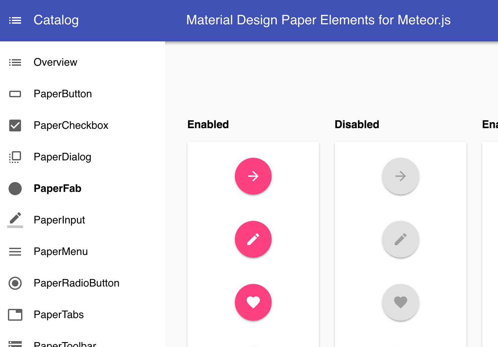

# blaze-material-ui

> This is an alpha release so use it at your own risk. See below for a list of apps that use this in production


## Installation

Right now it is required to clone the repo and then use it locally. (see [local installation](#local-installation))
In future it will be available from atmosphere

```shell
meteor add codefights:blaze-material-ui
```

## Screenshots




## Demos

### Component Catalog
[official demo page](http://blaze-material-ui.meteor.com/)

### Apps using this library
[CodeFights](https://codefights.com)


## Local installation
```shell
cd [yourApp]
## if packages does not exist
mkdir packages
## manually add the package
cd packages
git clone git@github.com:Code-Fights/blaze-material-ui.git
cd ..
## add the package to meteor
meteor add codefights:blaze-material-ui
```

## Browser support

Currently targeted browsers are:

* Chrome (Desktop, Android)
* Firefox
* Safari 

(some browsers might have layout issues)

## Issues

Please feel free to contribute or report issues.

Since this is an alpha version we are making a new concept for or release candidate. It is most likely going to be a complete rewrite but we are happy about feedback and suggestions.


## Paper elements for Meteor 

This library provides material design elements in meteor.  
It is built on top of [meteor-blaze-compoents](https://github.com/peerlibrary/meteor-blaze-components) which uses [blaze](https://github.com/meteor/blaze)


## Create components from gulp

```shell
## requires --type and --name to be set
## --type will declare the folder
## --name will declare the component name
gulp component --type=paper-elements --name=PaperButton
```

will create
```
lib
 ┗━┳ paper-elements
   ┗━┳ PaperButton
     ┣━ PaperButton.js
     ┣━ PaperButton.scss
     ┗━ PaperButton.tpl.jade
```

## Usage

### Spacebars
```handlebars
<body>
  {{#PaperButton}}
    Button
  {{/PaperButton}}
</body>
```

### Jade
```jade
body
  +PaperButton() 
    | Button
```
