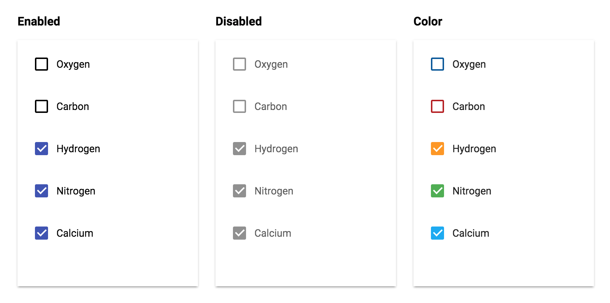

# PaperCheckbox


## Screenshot


## Usage

Basic usage

```
{{> PaperCheckbox}}
```

Add a custom className

```
{{> PaperCheckbox className="my-custom-class"}}
```

## Properties

* Checked

	```handlebars
	{{#PaperCheckbox checked="checked"}}[content]{{/PaperCheckbox}}
	```

* Disabled

	```handlebars
	{{#PaperCheckbox disabled=""}}[content]{{/PaperCheckbox}}
	```

## Styling

Style the checkmark with CSS as you would a normal DOM element.

```css
// Default Checkbox
.my-custom-class [data-id=checkbox] {
	background-color: blue;
	border-color: transparent;
}

// Checked Checkbox
.my-custom-class [data-id=checkbox].checked.paper-checkbox {
	background-color: darkblue;
	border-color: darkblue;
}

// Checkmark
.my-custom-class [data-id=checkmark].paper-checkbox {
	border-color: white;
}

// Checkbox Label
.my-custom-class [data-id=checkboxLabel].paper-check {
	color: blue;
}
```

By default, the ripple is the same color as the foreground at 25% opacity. You may customize the color using this selector:

```css
.my-custom-class::shadow paper-ripple {
	color: darkblue;
}
```