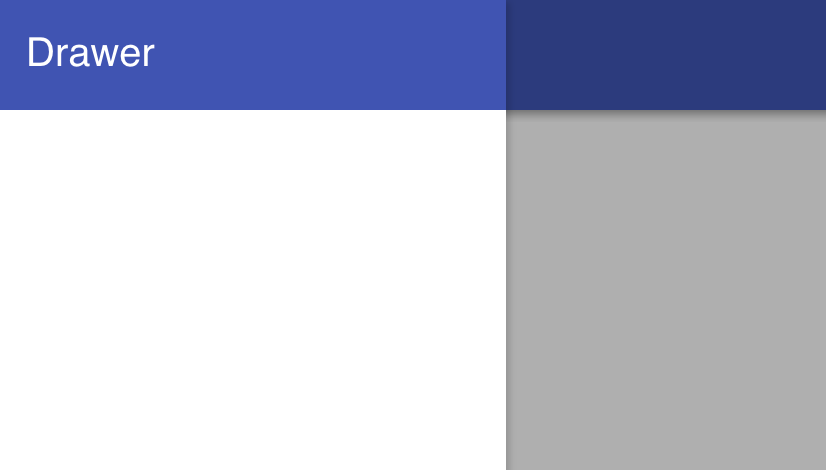

# PaperDrawerPanel 


## Screenshot


## Usage

Basic usage

```
{{> PaperDrawerPanel}}
```

Add a custom className

```
{{> PaperDrawerPanel className="my-custom-class"}}
```

Use an argument

```
{{> PaperDrawerPanel argument="some-argument"}}
```