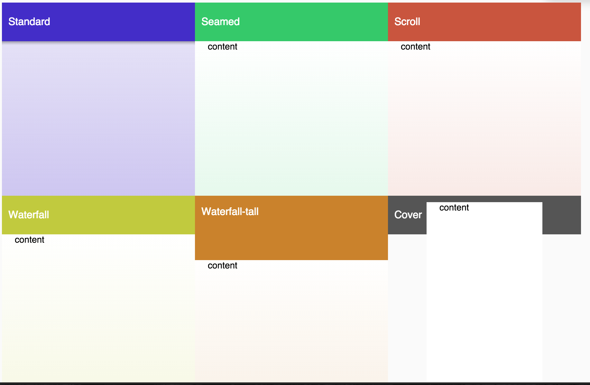

# PaperHeaderPanel 


## Screenshot


## Usage

Basic usage

```
{{> PaperHeaderPanel}}
```

Add a custom className

```
{{> PaperHeaderPanel className="my-custom-class"}}
```

Use an argument

```
{{> PaperHeaderPanel argument="some-argument"}}
```