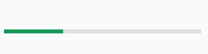

# PaperProgress

## Screenshot


## Usage

* Basic usage

	```handlebars
	{{> PaperMaterial}}
	```

* Add a custom className

	```handlebars
	{{> PaperProgress className="my-custom-class"}}
	```

* Set the min & max

	```handlebars
	{{> PaperProgress min=0 max=100}}
	```

* Change the value

	```handlebars
	{{> PaperProgress value=30}}
	```

