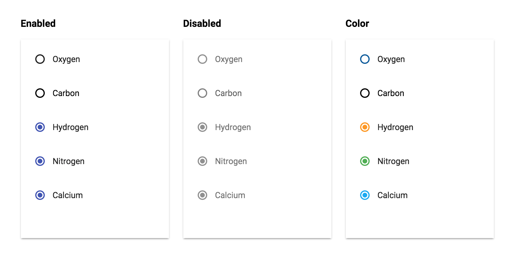

# PaperRadioButton


## Screenshot


## Usage

* Basic usage

	```
	{{> PaperRadioButton}}
	```

* Add a custom className

	```
	{{> PaperRadioButton className="my-custom-class"}}
	```

* Use an argument

	```
	{{> PaperRadioButton argument="some-argument"}}
	```

## Properties

* Checked

	```handlebars
	{{#PaperRadioButton checked="checked"}}[content]{{/PaperRadioButton}}
	```

* Disabled

	```handlebars
	{{#PaperRadioButton disabled=""}}[content]{{/PaperRadioButton}}
	```

## Styling

Style the checkmark with CSS as you would a normal DOM element.

```css
// onRadio
.my-custom-class [data-id=onRadio] {
	background-color: blue;
}

// offRadio
.my-custom-class [data-id=offRadio] {
	background-color: transparent;
	border-color: blue;
}
```

By default, the ripple is the same color as the foreground at 25% opacity. You may customize the color using this selector:

```css
.my-custom-class::shadow paper-ripple {
	color: darkblue;
}
```