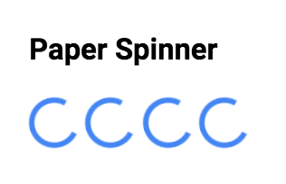

# PaperSpinner 

## Screenshot


## Usage

Basic usage

```handlebars
{{>PaperSpinner}}
```

Add a custom className

```handlebars
{{>PaperSpinner className="my-custom-class"}}
```

Activate

```handlebars
{{>PaperSpinner active="active"}}
```
