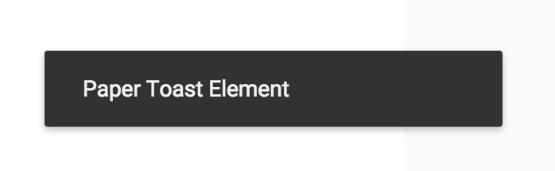

# PaperToast


## Screenshot


## Usage

Basic usage

```
{{> PaperToast}}
```

Add a custom className

```
{{> PaperToast className="my-custom-class"}}
```

Add custom text

```
{{> PaperToast text="Woo hoo! Paper Toast has arrived!"}}
```


## Styling

Style the checkmark with CSS as you would a normal DOM element.

```css
.my-custom-class {
  background-color: blue;
  color: white;
}
