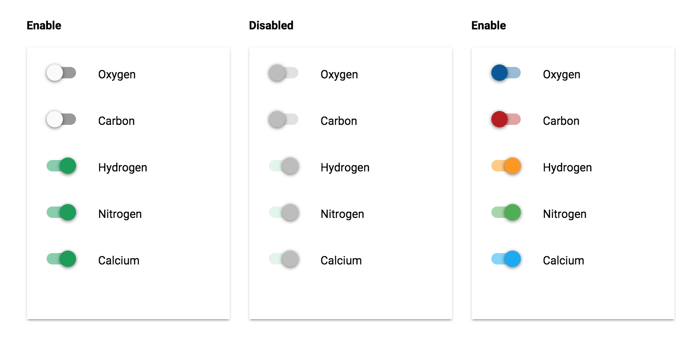

# PaperToggleButton


## Screenshot


## Usage

* Basic usage

	```
	{{> PaperToggleButton}}
	```

* Add a custom className

	```
	{{> PaperToggleButton className="my-custom-class"}}
	```

* Use an argument

	```
	{{> PaperToggleButton argument="some-argument"}}
	```

## Properties

* Checked

	```handlebars
	{{#PaperToggleButton checked="checked"}}[content]{{/PaperToggleButton}}
	```

* Disabled

	```handlebars
	{{#PaperToggleButton disabled=""}}[content]{{/PaperToggleButton}}
	```

## Styling

Style the radio button with CSS as you would a normal DOM element.

```css
// Toggle Button
.my-custom-class .toggle-button.paper-toggle-button {
	background-color: darkblue;
}

// Toggle Bar
.my-custom-class .toggle-bar.paper-toggle-button {
	background-color: blue;
}
```

By default, the ripple is the same color as the foreground at 25% opacity. You may customize the color using this selector:

```css
.my-custom-class::shadow paper-ripple {
	color: darkblue;
}
```