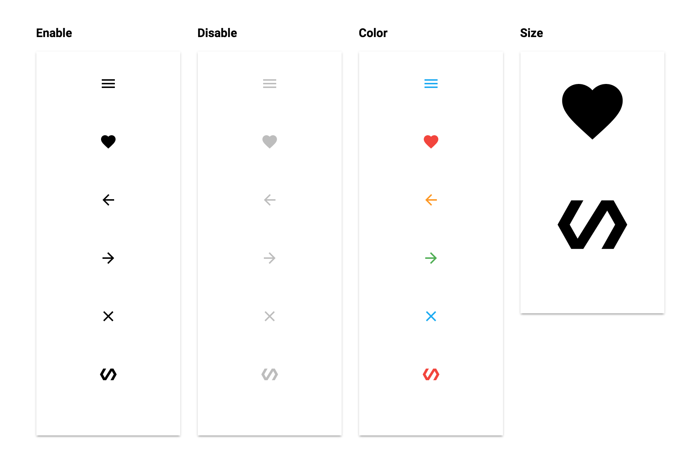

# PaperIconButton 


## Screenshot


## Usage

Basic usage

```handlebars
{{> PaperIconButton}}
```

Add a custom className

```handlebars
{{> PaperIconButton className="my-custom-class"}}
```

Change the icon

```handlebars
{{> PaperIconButton icon="refresh"}}
```